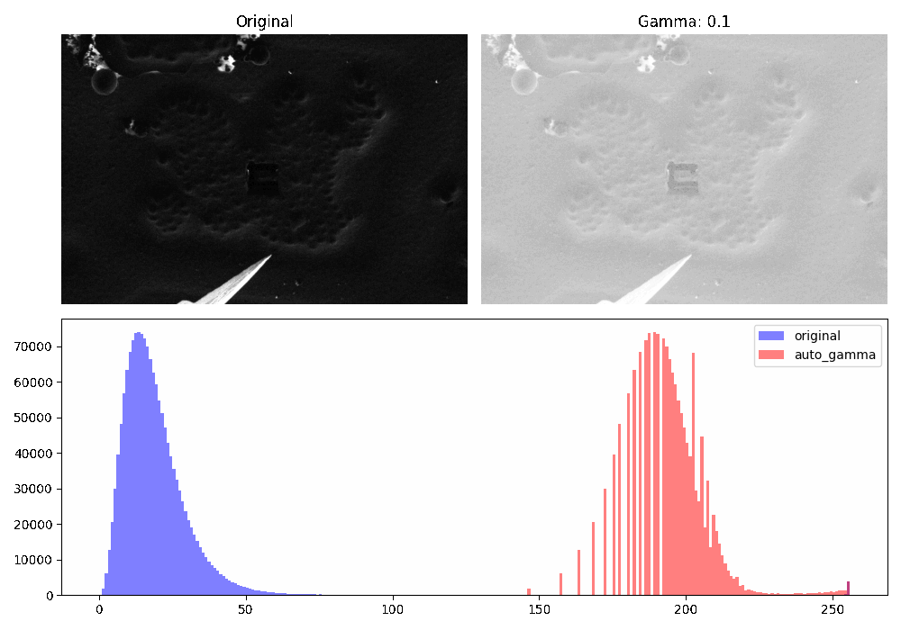
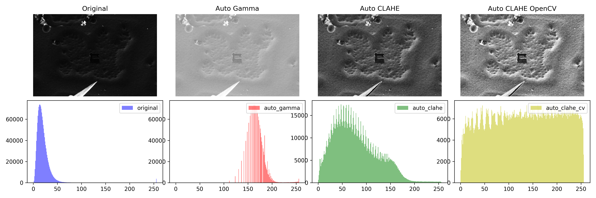
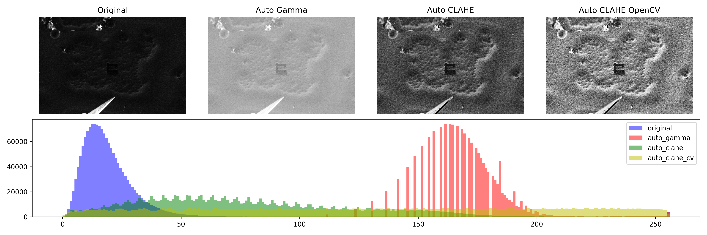
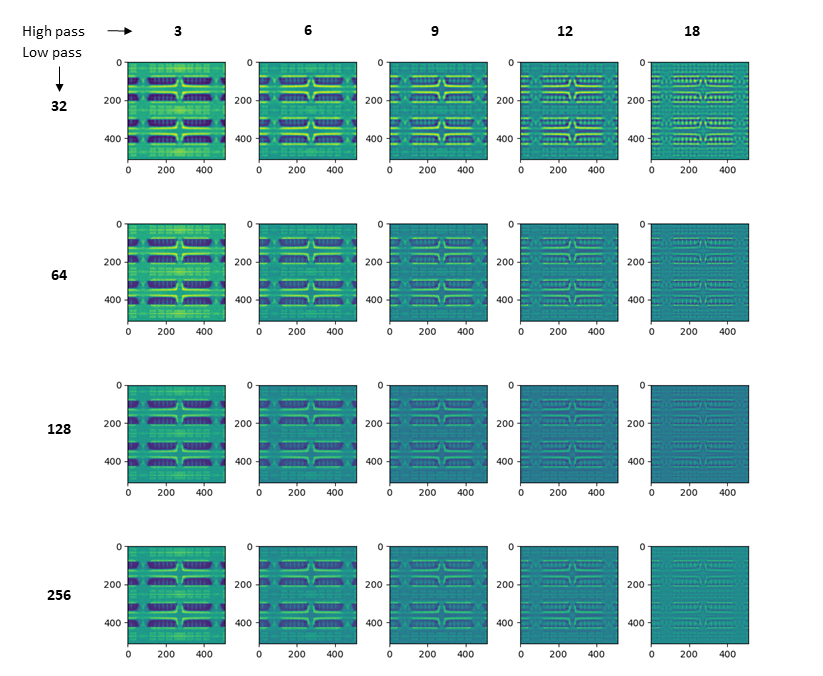
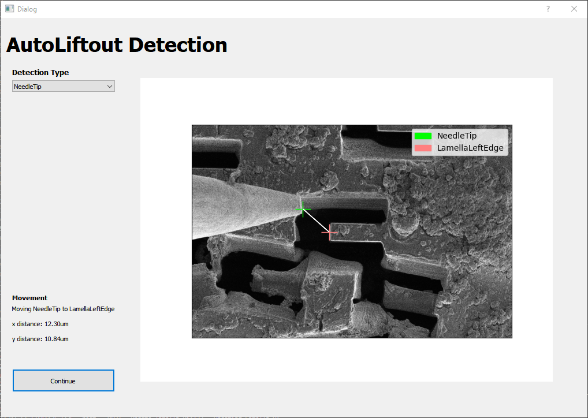
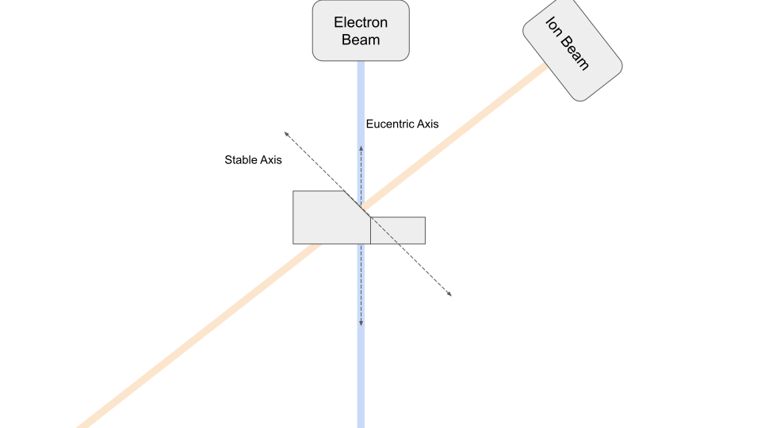
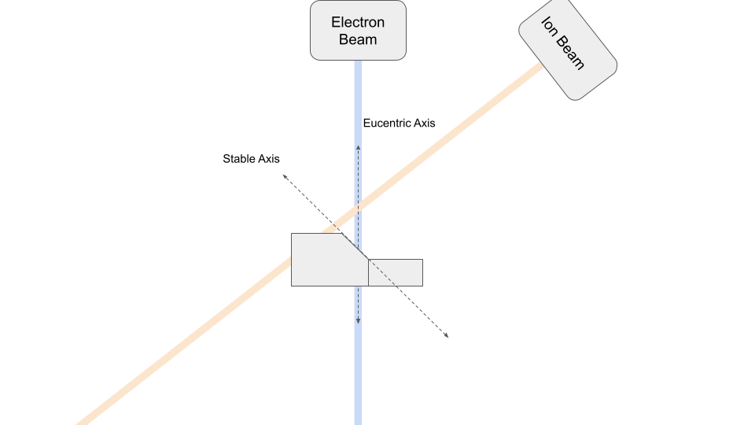

# Automation


OpenFIBSEM provides a number of modules to support automation.

## Image Processing

We provide a number of image processing functions to support automation. These are available in `fibsem.imaging`  or `fibsem.acquire`.

#### AutoGamma:

Adjusting the gamma of the image can improve the contrast of the image. This is useful for aligning images, and can be used to improve the contrast of the image for feature detection. The following figure shows the effect of adjusting the gamma of the image. When the `autogamma` flag is enabled in `ImageSettings` the gamma of the images taken will be automatically adjusted with this method. 


Gamma Adjustment

#### AutoCLAHE:

Contrast Limited Adaptive Histogram Equalization (CLAHE) is a method for improving the contrast of an image. When the `autoclahe` flag is enabled in `ImageSettings` the gamma of the images taken will be automatically adjusted with this method. AutoCLAHE has many parameters that can be tuned. The following figures shows the difference between the different autogamma methods. 


AutoGamma Functions


AutoGamma Functions

## Alignment

The alignment module contains functions are aligning reference images, and tools and parameters for adjusting these alignments.

WIP: images


### Cross Correlation

The primary alignment method is fourier cross-correlation to a reference image. The following helper function provides the the methods for alignment, and the required movements, as well as parameters for tuning.

```python
def align_using_reference_images(
    microscope: SdbMicroscopeClient,
    settings: MicroscopeSettings,
    ref_image: AdornedImage,
    new_image: AdornedImage,
    ref_mask: np.ndarray = None,
    xcorr_limit: int = None,
    constrain_vertical: bool = False,
    beam_shift: bool = False,
    lp_px: int  = 128, 
    hp_px: int = 8,  
    sigma: int = 6,
) -> bool:
    """Align new image to reference image using crosscorrelation
    
    Args:
        microscope (SdbMicroscopeClient): microscope client
        settings (MicroscopeSettings): microscope settings
        ref_image (AdornedImage): reference image
        new_image (AdornedImage): new image
        ref_mask (np.ndarray, optional): reference mask. Defaults to None.
        xcorr_limit (int, optional): crosscorrelation limit. Defaults to None.
        constrain_vertical (bool, optional): constrain vertical movement. Defaults to False.
        beam_shift (bool, optional): use beam shift. Defaults to False.
        lp_px (int, optional): lowpass filter size. Defaults to 128.
        hp_px (int, optional): highpass filter size. Defaults to 8.
        sigma (int, optional): gaussian filter sigma. Defaults to 6.
    Returns:
        bool: True if alignment was successful, False otherwise
    """
```
In order to tune the alignment the user can adjust the following:

#### Filtering
The cross correlation alignment can be tuned by adjusting the bandpass filters; lowpass, highpass; and sigma. These filters are applied in fourier space.
- `lowpass`: upper pixel distance bound
- `highpass`: lower pixel distance bound
- `sigma`: blur applied to bandpass mask boundary

The effect of these filters on the bandpass mask is shown below:



#### Masking
We provide a number of masking utilities: 

- `circle_mask`: mask a circular area of the image. 
- `bandpass_mask`: mask a bandpass area of the image (donut)
- `rect_mask`: mask a rectangular area of the image
- `area_mask`: mask quarters of the image specified by left, right, upper, and lower params
- `vertical_mask`: mask a central vertical area of the image
- `invert`: invert the mask

These masks can be passed to the `ref_mask`for use in the alignment, and are available in `fibsem.imaging.masks`. Many of these masking functions contain additional parameters, so please see the implementation for details. 

#### Movement
By default, the function will move the stage to align the reference image. The following parameters adjust this movement. 
   
- `constrain_vertical`: this flag will constrain the stage to move only vertically (z). This is useful when attempting to correct the eucentric position using alignment.
- `beam_shift`: this flag will adjust the shift the beam instead of moving the stage. The beam shift is more precise than the mechanical stage, but has a much lower range of movement (~10um?, check this)


### Utilities
We also provide a number of utility functions that can help with crosscorrelation. For example:

- `rotate_image`: rotate the image 180deg while preserving metadata
- `fromFibsemImage`: match the image settings used for reference image

 These utilities are available in `fibsem.imaging.utils`.

### Helper Functions
The `fibsem.alignment` module contains more helper functions for performing alignment workflows:

- `correct_stage_drift`: multi-step alignment
- `eucentric_correct_stage_drift`: multi-step alignment + eucentric alignment

## Feature Detection
We provide some feature detection functions and workflows primarly centred around the liftout workflow. These are customisable to the user's needs.

The primary detection workflow uses the following to run the feature detection, transform coordinate systems, and optionally allows the user to validate the result. For more information on the user validation please see [ml.md](ml.md).

```python
def detect_features_v2(
    microscope: SdbMicroscopeClient,
    settings: MicroscopeSettings,
    features: tuple[Feature],
    validate: bool = True,
    mask_radius: int = 256,
) -> DetectedFeatures:

    """Detect features in microscope image.
    
    Args:
        microscope (SdbMicroscopeClient): microscope client
        settings (MicroscopeSettings): microscope settings
        features (tuple[Feature]): features to detect
        validate (bool, optional): whether to validate features. Defaults to True.
        mask_radius (int, optional): radius of mask to apply to image. Defaults to 256.

    Returns:
        DetectedFeatures: detected features
    """
    ...

```


The supported Feature Types are as follows:

::: fibsem.detection.detection.Feature
::: fibsem.detection.detection.LamellaCentre
::: fibsem.detection.detection.ImageCentre
::: fibsem.detection.detection.LamellaRightEdge
::: fibsem.detection.detection.LamellaLeftEdge
::: fibsem.detection.detection.NeedleTip
::: fibsem.detection.detection.LandingPost


## Machine Learning
We provide a basic machine learning pipeline and workflow. Currently only segmentation models are supported, but more will be added in the future.

For detailed information on the machine learning tools, please see [Machine Learning](ml.md).


## Movement

The movement module contains functions for moving the microscope stage. 

We provide a number of advanced movement functions that are useful for correcting and maintianing the eucentricity of the microscope.



### Vertical Movement

Vertical movements correct the eucentric position of the microscope. This is useful when initially setting up the microscope, or when the eucentric position has been lost. The vertical movements move the stage vertically in the chamber to correct the eucentric position.



To use eucentric movements, use: 
```python
microscope.vertical_move(settings, dy)
```

::: fibsem.microscope.ThermoMicroscope.vertical_move

where dy is the distance to move in the image plane (eucentric movements are always calculated from the ion beam perspective).


### Stable Movement

Stable movements maintain the sample at the eucentric position, allowing for movement along the sample plane without losing the eucentric position. This is useful for performing liftout, and other tasks that require movement along the sample plane.


To use stable movements, use: 
```python 
microscope.stable_move(settings, dx, dy, beam_type)
```
where dx, dy are the distance to move in the image plane, and beam_type is the beam type to use for the movement.

::: fibsem.microscope.ThermoMicroscope.stable_move
