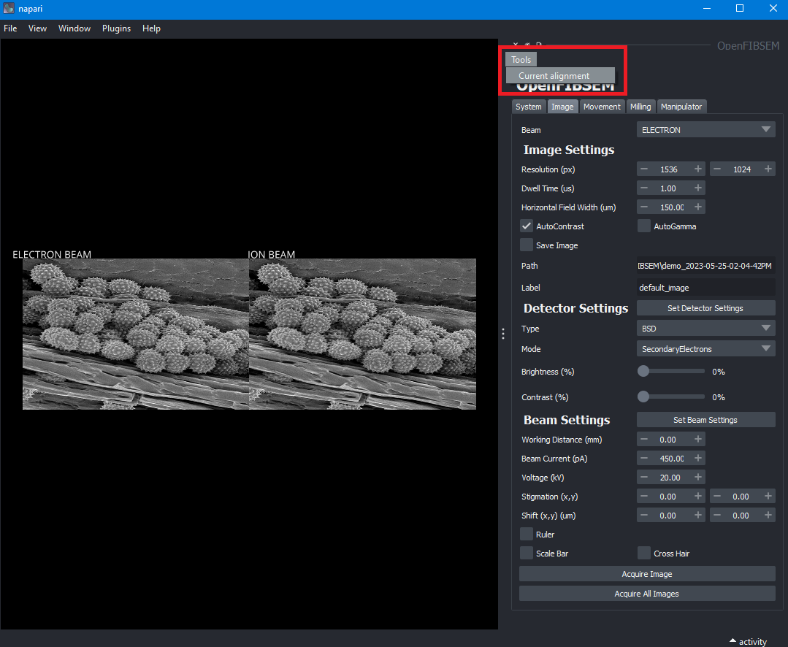
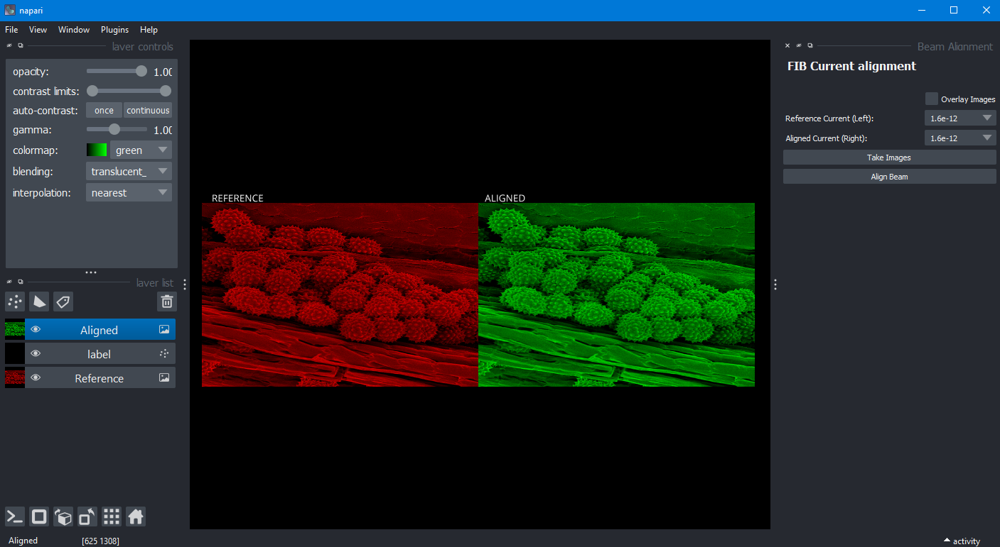
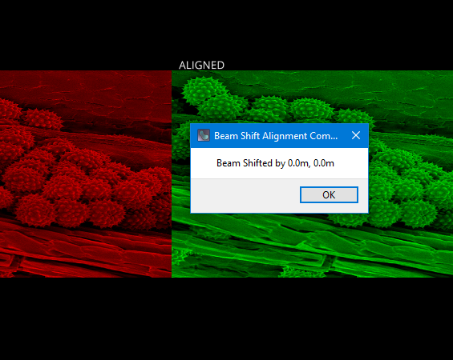
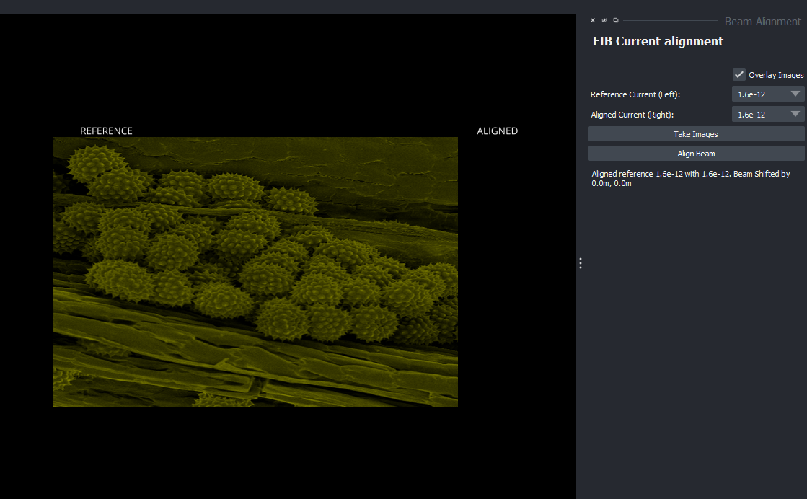
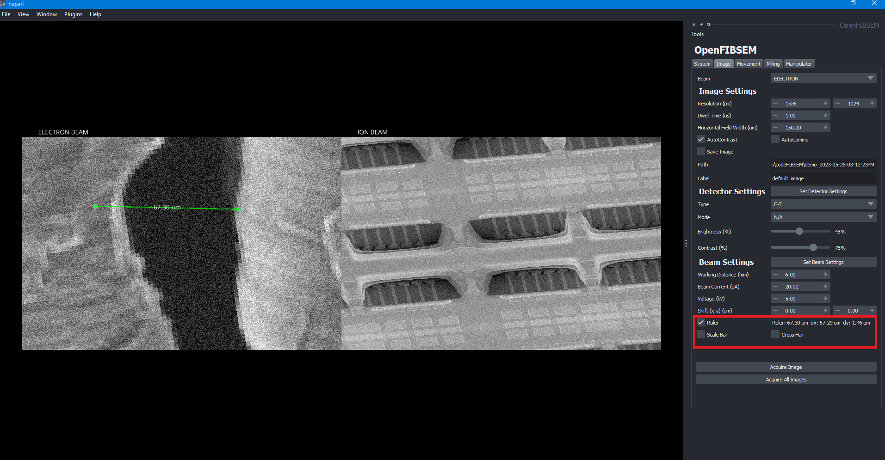
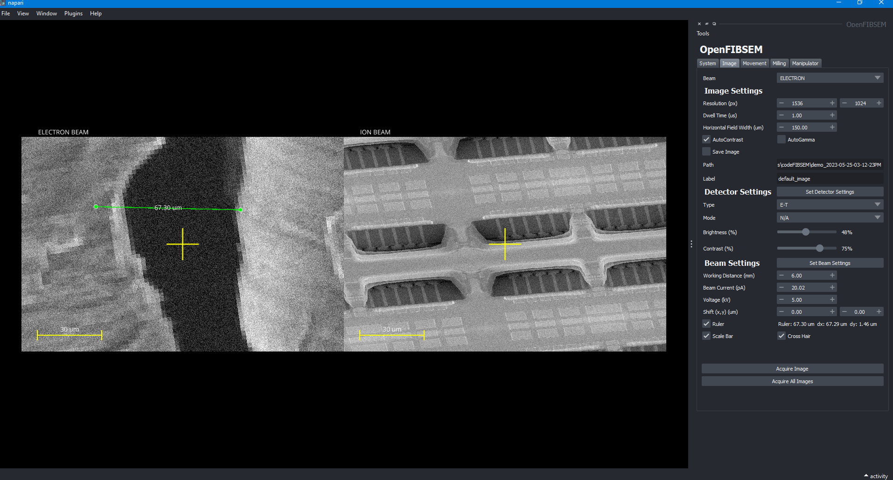

# Features

## Beam Current Alignment

The beam current alignment feature is a calibration tool to perform beam current alignment. It can be easily accessed and from the tools menu.

This will open a new window which will allow the user to align the currents to a reference. 

To begin, the user must take images by clicking on the button labelled as "Take Images". This takes two images, one for the reference and one for aligning.

The images are labelled as reference and aligning which allows the user to visually comparing when aligning the beam. The reference and the aligning currents can be selected using the drop down available on the right.

To align the beam, the user must simply click on align beam. When alignment is done, a pop up window will reveal the shift needed to align the images

Clicking 'OK' will close the window and the user can continue to align the beam with other currents. Below the buttons there will be a list for reference which shows which currents have been aligned.

Clicking the "Overlay Images" checkbox will overlay the two images for comparison which provides another visual check for alignment.

Once the user is satisfied with the alignment, they can close the window and return back to the main OpenFIBSEM window. If necessary, this tool can be run again when required.

## Measurement Tools

OpenFIBSEM has a napari based built in ruler to measure distances on an image. The ruler can be toggled on and off in the Image tab of the main window.

The check box enables or disables the ruler. Please note, while the ruler is **enabled** the user will **not** be able to interact with the image. To interact with the image, the ruler must be **disabled**. Standard image features such as panning, zooming, clicking to move and so on are all only available when the ruler is disabled.

To measure a distance, the user must drag either the left or the right point. Dragging a point will update the measured distance automatically. The line **cannot** be moved, only the points.

Next to the checkbox, the measured distance is calculated in microns. The dX and dY values are also displayed. The measured values are simply a pixelwise calculation of the distance based on the horizontal field width (HFW).

The ruler can be used on either the ION image or ELECTRON image. The point can dragged to either side to calculate distance in an image. If the two images do not share the same HFW, then the HFW of the image on which the left point is on will be used to calculate the distance. Hence ensure that both points are wholly in a single image.

There is also a static scale bar and cross hair point that can be enabled or disabled in the Image tab. The scale bar automatically updates if the HFW is changed and a new image is taken.

