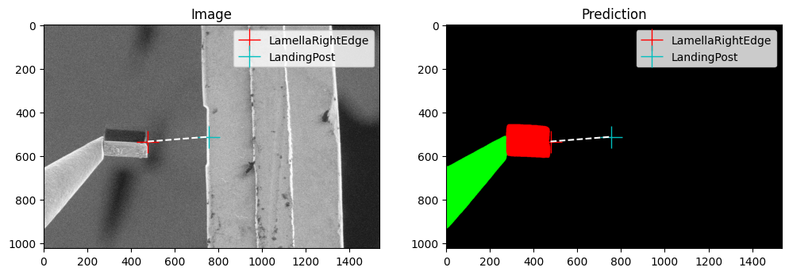
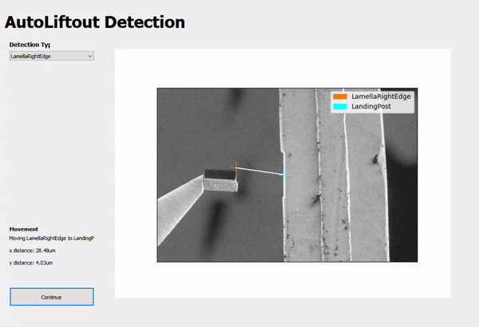

# Machine Learning

OpenFIBSEM contains a number of tools designed to support machine learning workflows.

## Segmentation
The Segmentation Model Training Pipeline is a user-friendly tool for training models for semantic segmentation. This pipeline makes use of off-the-shelf UNet models, which are known for their simplicity and efficacy. However, for those who wish to use their own custom models, the pipeline also allows for such customization.

The pipeline is designed to work with TIFF images and corresponding label maps. The user can easily train their own segmentation model on their own data by editing the config.yaml file located in the segmentation directory. This config file allows the user to specify the model architecture, training hyperparameters, and the data to be used for training. With just a few modifications to the config file, the user can start training their segmentation model in no time.

The primary files in the model are:
- `train.py`: training pipeline
- `model.py`: segmentation model class
- `dataset.py`: segmentation dataset class

### config.yaml
```yaml
train: 
  data_dir: /home/patrick/github/data/train/        # Directory of training data
  save_dir: /home/patrick/github/fibsem/models/     # Directory to save models
  checkpoint: null                                  # Checkpoint to start training from
  encoder: "resnet34"                               # Specify model architecture. List of available encoders in readme.
  epochs: 20                                        # Number of epochs to train for
  cuda: true                                        # Enable/Disable CUDA training
  batch_size: 4                                     # Number of samples per batch
  num_classes: 3                                    # Number of classes in segmentation labels. Includes background as class 0.
  learning_rate: 0.0001                             # Training Learning Rate
  wandb: true                                       # Logs information and plots to wandb
  wandb_project: "fibsem_pipeline"                  # [Optional] wandb project
  wandb_entity: "demarcolab"                        # [Optional] wandb entity
```



## Data Labelling
The Segmentation Labelling User Interface is a tool that has been developed using the Napari library. The interface has been developed to work seamlessly with OpenFIBSEM images. 

The Labelling UI has been developed to work natively with the segmentaion model training pipeline. This integration makes it incredibly easy for users to quickly label images and feed the data into the training pipeline. The user interface provides an intuitive and user-friendly interface for annotating images, allowing users to quickly and accurately label images for training their segmentation models. This integration greatly streamlines the process of preparing data for training and speeds up the overall development process.


## Active Learning
The generation of microscopy data is a time-consuming and expensive process. To address this challenge, an active learning pipeline has been integrated into the Fibsem framework. This pipeline allows for more efficient training data collection and model improvement, making the best use of the limited data available.

The active learning pipeline is activated when the user uses the "validate" flag in the detect_features_v2 function. When this flag is enabled, the user will be prompted to validate the features detected by the model. If the user finds any errors in the detection, they can correct it, and a copy of the image will be saved along with the flags for labelling. These error cases can then be labelled using the labelling tools provided, and the model can be re-trained and deployed, improving its performance over time. This process has been used internally to achieve significant improvements in the performance of the segmentation models for Fibsem workflows.




## Labelling

We have developed an integrated labelling tool for segmentation dataset.

### Labelling UI

The Labelling UI allows users to draw the labels (masks) for training a segmentation model. To see more detailed instructions, see the guide on labelling and detection widgets [here](ml_details.md)

### Model Assisted Labelling

The model assisted labelling tool allows you to use a trained model to assist in the labelling of new data. This is useful for labelling large datasets. The model will make a prediction and the user can correct the prediction using the same drawing tools.

To use, go to the Model tab and load your model, and then tick 'model assisted' to enable the model assisted labelling.


### Experimental

We have implemented the Segment Anything Model from MetaAI. This model is trained to segment any object. Here we use it as part of the model assisted labelling 


For more detailed about SAM see: https://github.com/facebookresearch/segment-anything

To use SAM:
  
  ```python
pip install git+https://github.com/facebookresearch/segment-anything.git
pip install opencv-python pycocotools matplotlib onnxruntime onnx

```

Download weights: [SAM ViT-H](https://dl.fbaipublicfiles.com/segment_anything/sam_vit_h_4b8939.pth)