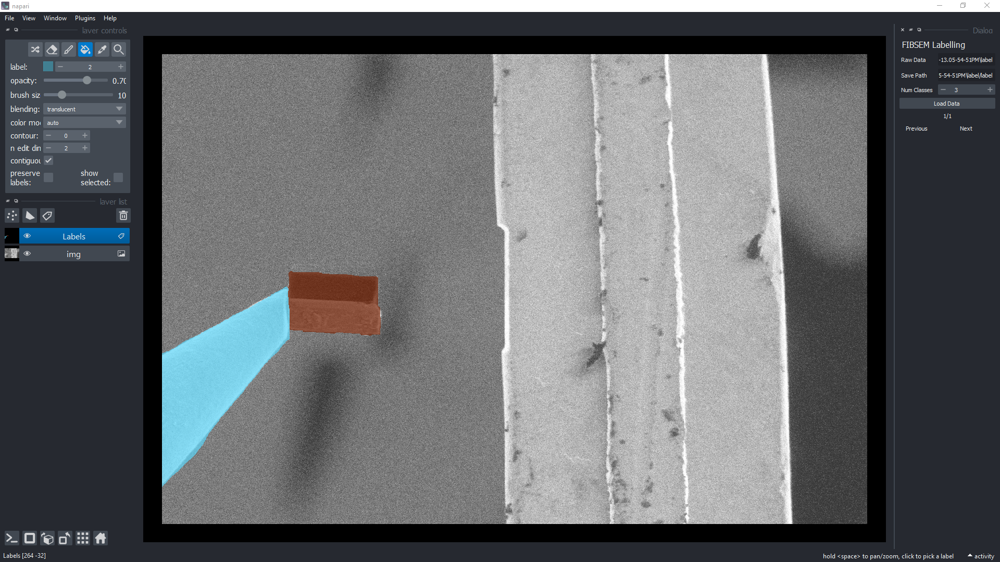
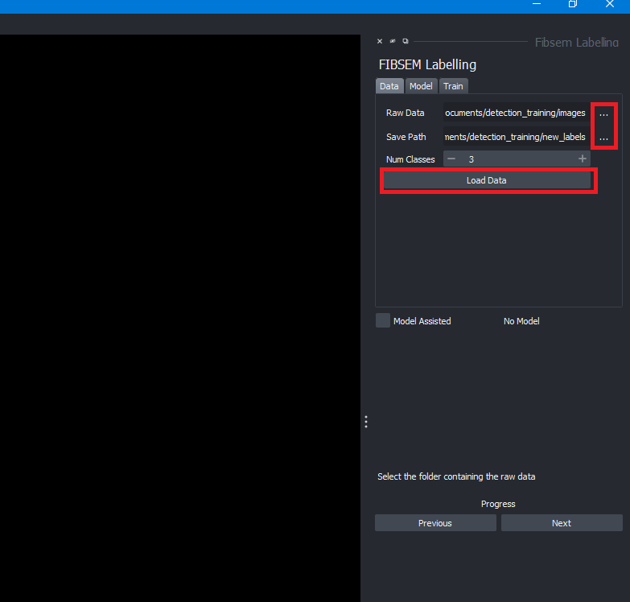
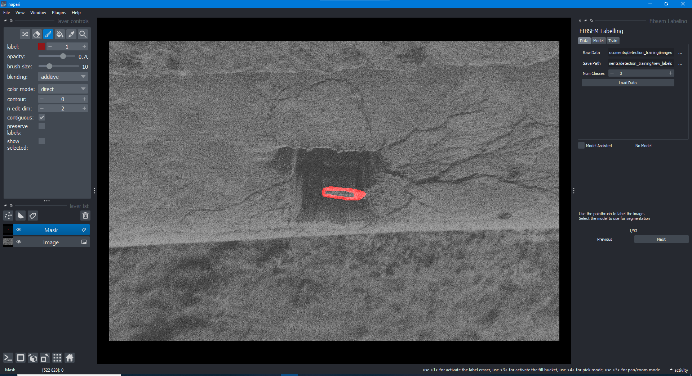
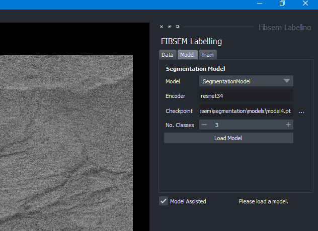
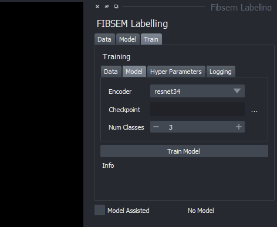
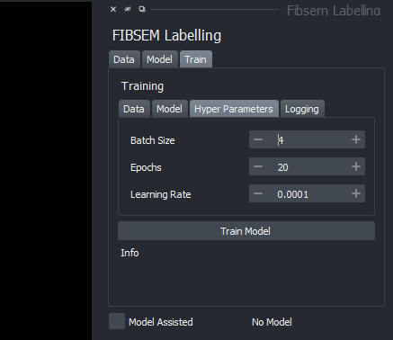
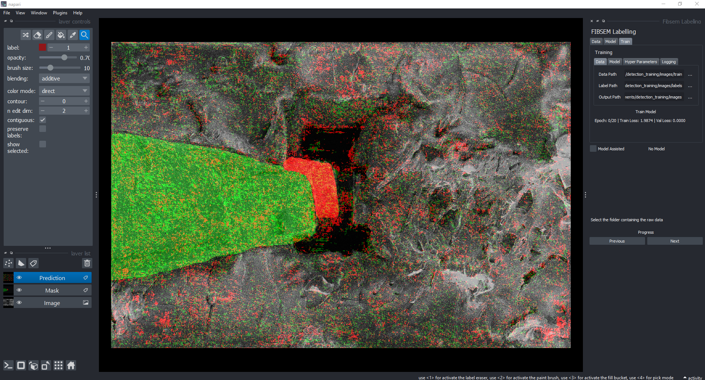

# Labelling UI Guide

## Labelling UI widget

The labelling widget is built into OpenFIBSEM and provides an image processing tool to prepare labels for the purposes of training an segmentation machine learning model such as UNet. The model can run on CPU however a CUDA enabled GPU is recommended for speed and efficiency.

## Labelling UI workflow

To begin, launch the UI and load the directories in which the images are that are to be labelled and the directory in which the labels are to be saved. Clicking the button with the three dots will open a file explorer window to select the directory. Once the paths are set, click the "Load Data" button to load the images and labels.

The number of classes refers to the unique number of objects to be segmented. In our example, we have the needle and lamella which are two classes. The number of classes can be changed at any time and the UI will update accordingly.

Once the data has been loaded. The first image will be displayed in the main napari window. The image can be manipulated as normal using the napari controls. 

To label the images manually, select the mask layer and apply the brush tool. The brush tool can be selected and manipulated as standard in napari. The standard napari toolbar can be seen on the top left in the figure above.

The images in the data set can be cycled through by clicking previous or next. The current image index is displayed above the next/previous buttons. 

### Model assisted labelling

The model assisted labelling tool assists the process to reduce the effort of manually labelling the data with the brushing tool. The model provides a prediction of the image and the user can then correct the prediction by brushing over the image.

A CUDA enabled GPU is not required for training purposes but it is recommended for efficiency. 

To enable model assisted labelling, first load a model in the model tab. Ensure that the correct checkpoint and encoder is loaded. The model path can be loaded using the 3 dots button to open the file directory. The model can then be loaded by clicking the Load Model button.

Once the model is loaded, click the Model Assisted checkbox if it is not already done so. The images will now automatically be semi-labelled and can be adjusted as necessary with the paint brush tool. The model assisted labelling can be toggled on and off at any time. The labels are saved automatically and switching between images will automatically update the labels.

## Training a new model

A new model can also be trained based on the images and labels created within this UI itself. To train a new model, ensure you have a image set with labels. The models are created and trained using PyTorch. The models are saved as .pt files and can be loaded in to the UI for model assisted labelling or for any other purpose.

To setup, begin by going to the **Train** tab and setting up the paths to the images and labels. The output path is the location where the newly trained model will be saved.

**Ensure that the number of images and the number of labels are the same length**

In the **Model** tab, you can set parameters for the model.
- Encoder: the encoder used for the segmentation model (e.g. resnet34)
- Checkpoint: the name for the checkpoint when training the new model
- Number of classes: the number of classes in the data set

In the **Training** tab, you can set parameters for the training.
- Batch size: the batch size used for training
- Number of epochs: the number of epochs to train for
- Learning rate: the learning rate used for training

In the **Logging** the use of Weights And Biases (WANDB) can be setup if desired. WANDB is a tool for logging and visualising training runs. To use WANDB, you will need to create an account and login. The WANDB API key can be found in your account settings.

Click the "Use Weights And Biases" checkbox if using WANDB.

Once everything is set up, press train model and the training will begin. The training progress will be displayed in the terminal. The WANDB dashboard can be used to visualise the training progress. The progress of the model training is visualised in the main window

Once the training is done, the model can be accessed from the location where it is saved and can be loaded in to use for assisted labelling or any other purpose.