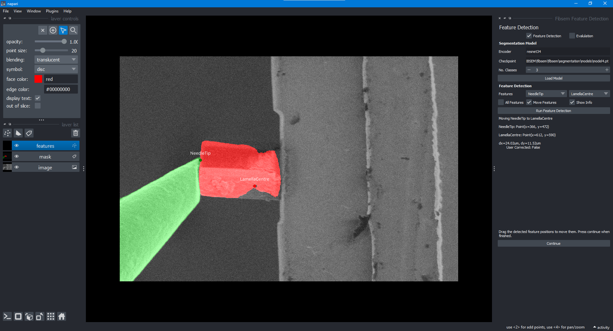
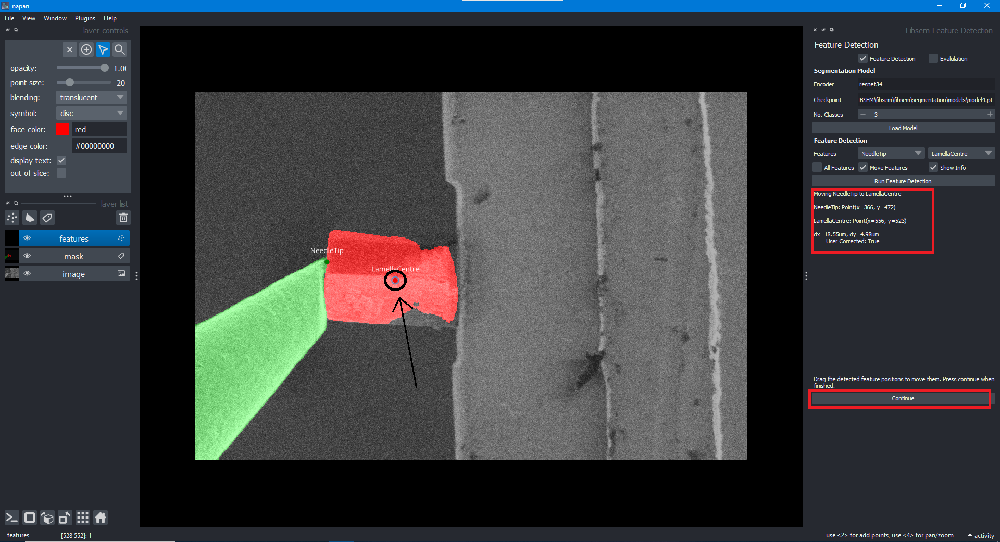

# Feature Detection and Correction Widget

The feature detection widget is a supplementary tool used to detect and correct features in the image. The widget is built into OpenFIBSEM and used a napari pop up window to correct or make changes to features that have been detected by the model. The model can run on CPU however a CUDA enabled GPU is recommended for speed and efficiency.

One of the current use cases that this widget is used for is to correct the needle and lamella features that have been detected by the model. If the model is inaccurate with the detection, the user can make changes to the feature positions in a simple UI. The positions are then used for needle movement.

Ideally, this widget would be used in conjunction with an existing workflow to make changes on the fly if necessary, for example, correcting the location of a feature for milling, correcting the location for needle movement and so on.

This is an example of the feature detection widget. In this scenario, it is relevant to identify the locations of the needle tip and lamella centre. The features detected by the model and its corresponding locations can be seen. Here the location of the needle tip is accurate, however, the lamella centre seems to be incorrect. Hence the user can make changes to this very easily.

The user simply can move the point labelled lamella centre towards a more accurate location to properly label the detection. The change can be seen in the right hand side, with information in pixel coordinates. The flag user corrected is raised to true to inform the system that the user has made changes to the feature location. If necessary, clicking "Run Feature Detection" will run the model again to detect the features. The user can then make further changes if necessary.

Once completed, clicking "Continue" will pass on the relevant information to the next step in the workflow. In this case, the needle tip and lamella centre coordinates are passed on to the needle movement widget.