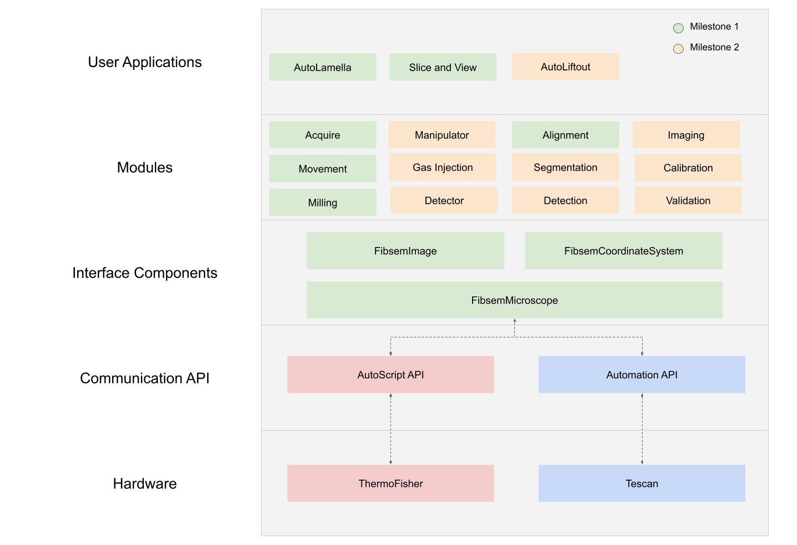

# Project Roadmap

The following is a roadmap of the planned OpenFIBSEM development.This roadmap is being developed in the v2 branches. 

## Milestone 01
Support for two manufacturer's hardware, and core functionality implemented.

- FibsemMicroscope
- FibsemImage
- FibsemCoordinateSystem
- Acquire
- Movement
- Milling

## Demo 01
Present two demo applications using core functionality, and test real uses cases across hardware. 

- AutoLamella v2: automated cryo-lamella lamella preparation - [AutoLamella V2](https://github.com/DeMarcoLab/autolamella/tree/autolamella_v2)
- Salami: automated slice and view 

## Milestone 02
Auxillary systems implemented, detectors, and non-core functionality
- Validation
- Calibration
- Manipulator
- GasInjectionSystem
- Detector
- Imaging
- Segmentation

## Demo 02
- AutoLiftout