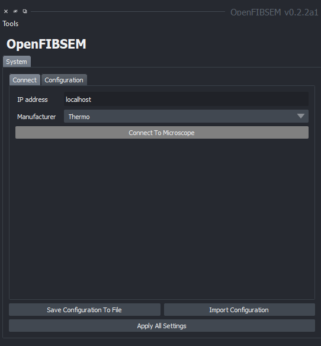
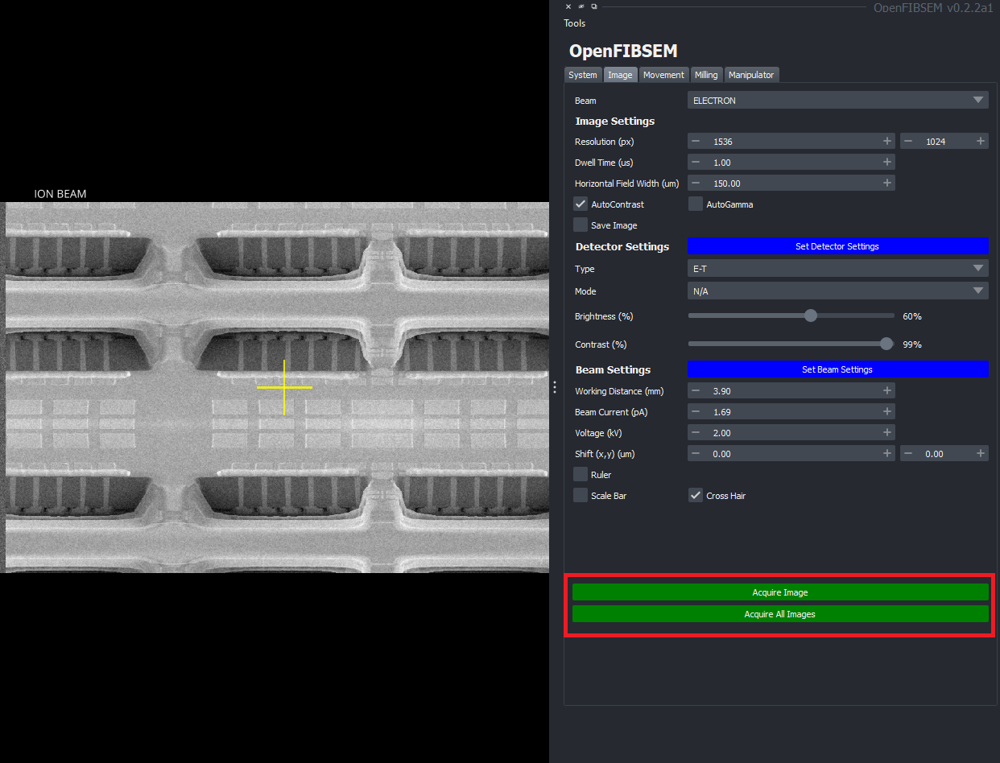

# Connecting to a Microscope

To begin connecting to a microscope, click on the connect tab. Here, you can connect to a microscope, load a configuration file, save a configuration file, and apply the settings to the microscope.

Initially, none of the subsystems are connected and only the configuration tab is available. Please refer to the [System Configuration and Setup Guide](system_setup.md) for more information on the configuration tab. Make any changes there if necessary or continue to simply start with the default configuration.

In the connect tab in the I.P. Address section, enter the I.P. address of the microscope, or localhost if the microscope is on the same computer. Then, click on the dropdown for manufacturer and select the manufacturer of the microscope. 

Once done, click connect to microscope. This will connect to the microscope and load the default configuration. If the connection is successful, the button will display 'Microscope Connected' and the button will be highlighted in green. The other subsystem tabs will also become available.

If connection is unsuccessful, an error will arise. Please refer to the error messages for information on the error and troubleshooting solutions.

Once connected to a microscope, other functionality is available. To take an image, click on the Image tab. Ensure the settings are as desired and click 'Acquire Image'. This will take an image and display it in the image viewer. Click 'Acquire All Images' to take both an ion and electron image. Please see the [imaging section](imaging.md) for more information on the Imaging.

