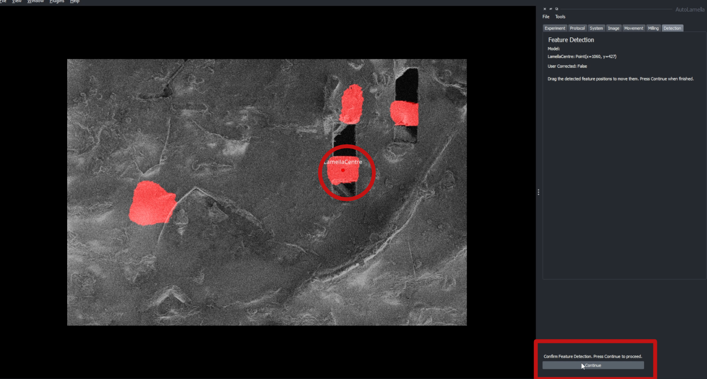

# Feature Detection and Machine Learning Tools

OpenFIBSEM hosts a variety of machine learning tools incorporated into the workflows for lamella preparation. This includes feature detection and classification through image segmentation and detection. 

Through the use of detection and classification, OpenFIBSEM can be used to automate the process of lamella preparation. This is done by detecting the features of interest and classifying them into the relevant categories. This allows for the process to make decisions on its own regarding movement and milling ultimately reducing the need for human input. 

OpenFIBSEM provides several baseline models for different methods and samples available on [huggingface](https://huggingface.co/patrickcleeve/openfibsem-baseline) for this purpose. These models have been finetuned for cryo-lamella preparation on different samples. You can also load from a local checkpoint, by specifying the full path. 

To constantly improve the model, OpenFIBSEM also allows for user feedback to be incorporated into the model. This is done by allowing the user to verify the detection and classification of the features of interest. This feedback is then used to train the model to improve its accuracy. By default this data is logged to fibsem/log/data/ml. This can be changed in the config file.

## Model selection

To load a baseline from huggingface, specify the checkpoint name, and matching encoder. The encoder to use can be determined by the naming scheme of the checkpont, (e.g. openfibsem-baseline-34.pt -> encoder="resnet34", openfibsem-01-18.pt -> encoder="resnet18")

A model can be loaded like so by using the load_model function found in fibsem/segmentation/model.py

```python

from fibsem.segmentation.model import load_model

# load model checkpoint from huggingface (openfibsem-baseline-34.pt)
model = load_model(checkpoint="openfibsem-baseline-34.pt", encoder="resnet34")

# load base model (imagenet checkpoint)
model = load_model(checkpoint=None, encoder="resnet34")

# load a local checkpoint
checkpoint_path = "path/to/model/checkpoint.pt" # Using model saved on disk
model = load_model(checkpoint = checkpoint_path, encoder = "resnet18")

```
## Feature Detection in Automated Lamella Preparation

Segmentation and feature detection is used in the automated lamellae preparation process to guide movement and milling. The regions of interest are segmented and detected, which are then used to control or make changes to position and milling parameters.



In the example shown above, the user is at the stage to mill the undercut for a lamella. The user is also supervising the workflow which ensures that the user has the final decision on the detection and feature position. 

When repositioning to mill the undercut, the system runs feature detection to identify the position of the lamella centre to ensure accurate movement of the stage. In the image, the segmentation and detection of the lamella is shown. The feature of interest being the lamella centre is set as a point in the napari viewer.

The user is then prompted to verify the detection and position of the feature. Here, if the position is invalid or incorrect, the user can simply drag the point to the correct location and press continue to proceed.

This process of user verification is enabled when the workflow is run in supervised mode on the selected stages. When the workflow is run in unsupervised mode, the model is used to control the workflow without verification from the user. This is the ideal case when the model has been trained to a point user verification is not required, further reducing human involvement in the process.


## Feedback and Model Training

When in supervised mode, the user is prompted to verify the detection and position of the feature. When the user makes changes to the detection, metrics such as the new correct position, and how far the detection was from the user corrected position is used to analyse the performance and retrain the model if and when necessary.

Based on whether the detection was correct or not, the images can be split into a training and validation dataset. The training dataset is used to train the model and the validation dataset is used to evaluate the model.

OpenFIBSEM programs are constantly collecting this training and validation data enabling the model to be trained and improved over time. This allows for the model to be constantly improved and updated to the latest data.