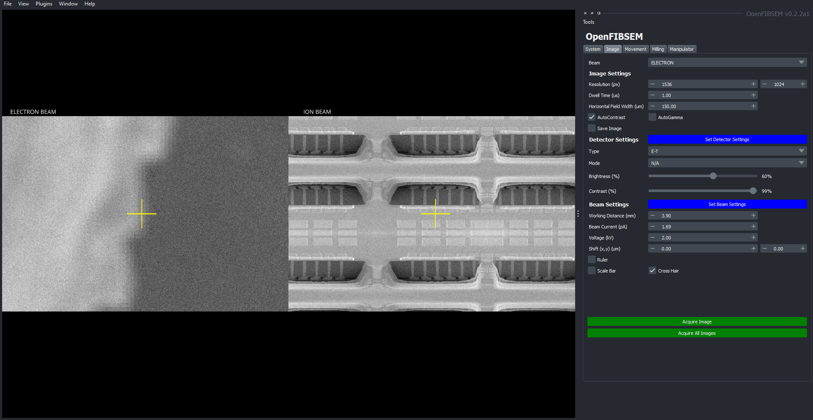
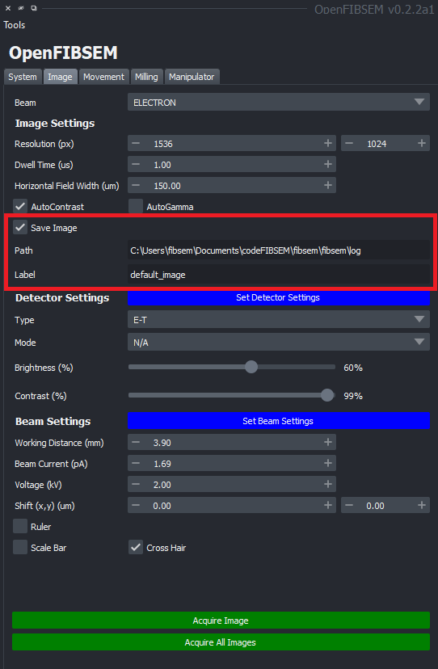

# Imaging

The imaging tab provides a suite of functionality to control the imaging process on both the electron and ion beam. This includes controlling image settings such as resolution and dwell time and processing methods such as auto contrast and autogamma.

The settings for the detectors and the beam can also be altered here. There are also additional tools such as a scale bar and a ruler to take measurements. Details on these tools can be found [here](../features.md)

The crosshair can be enabled or disabled in this tab as well. 

When making changes to these settings, the settings will take effect when clicking 'Acquire Image'. The settings can be individually applied to the electron or ion beam or both simultaneously. The beam dropdown allows the user to select which beam to make changes for.  

## Image Settings

These settings are responsible for basic image parameters such as resolution, dwell time and horizontal field width. The resolution is specified in pixels, dwell time in micro-seconds and horizontal field width in microns. 

There are also additional processing methods available, the AutoContrast and AutoGamma functions can be enabled or disabled as necessary. Enabling them activates the function for every image taken.

Images can also be saved when required. Click the save image checkbox to enable image saving everytime a new image is taken. When enabled, additional fields will appear to allow the user to choose the save location and the file name.

## Detector Settings

This section allows the user to alter and specify the detector settings available on the microscope. This includes the type and mode if available. The brightness and contrast can also be adjusted. To apply the changes, click 'Set Detector Settings' and then click Acquire Image(s) to take the image.

## Beam Settings

This section allows the user to modify the beam settings available on the microscope. This includes the  working distance (specified in mm), beam current (specified in picoAmps), voltage (kV) and beam shift in x and y (specified in microns). To apply the changes, click 'Set Beam Settings' and then click Acquire Image(s) to take the image.
