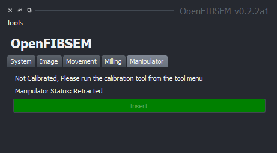
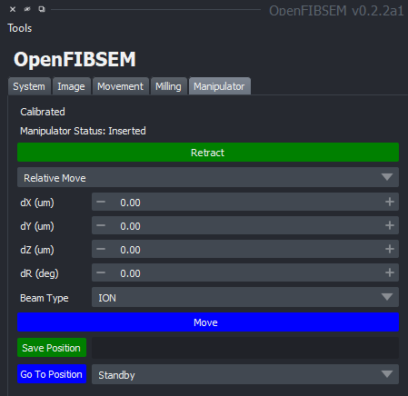

# Manipulator

The nanomanipulator or needle is a subsystem in some FIBSEM systems to allow for manipulation of the sample. This is typically used for lift-out and sample preparation. OpenFIBSEM allows for control of the manipulator through movement and saved positions. The manipulator section allows control for insertion and retraction along with movement in the x,y and z axis and rotation if supported.

## Manipulator Calibration (TESCAN)

For TESCAN systems, the manipulator needs to run a calibration setup upon first time usage on a microscope. This is done to correlate the named positions setup by TESCAN to the actual microscope coordinates, which allows reading the current position of the manipulator in terms of its name.

If the manipulator is not calibrated, the subsystem will be disabled with the message indicating that the manipulator needs calibration. This is a one time operation but can be redone if necessary.

To calibrate the manipulator, click on the tools menu and select "Manipulator Calibration". This will begin the process of calibration, during which, the manipulator moves rapidly between the "Parking", "Standby" and "Working" positions. Before calibrating it is recommend to move the stage down to ensure that the manipulator is free of obstructions so that no damage is done to the system. Follow the prompts on the screen to complete the calibration. It is completely automatic and requires no other user input. Once completed, it will be ready to use.

## Manipulator Control

The manipulator can be inserted and retracted as necessary. Inserting the manipulator brings it to the working area and retracting it brings it back to the standby position. 

The manipulator can be controlled in the available axes, namely the x,y,z and rotation. The manipulator can be moved in the x,y,z axes by entering a value in the respective field and clicking the "Move" button. The movements made are relative moves. However, positions can be saved as named positions and moved to directly. 

To save the current position as a named position, enter a name into the save position field and click "Save Position".
To move to an available saved position, choose from the drop down menu and click "Go to Position" to go to the position.

