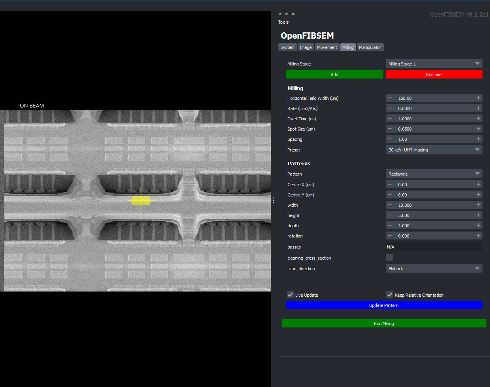
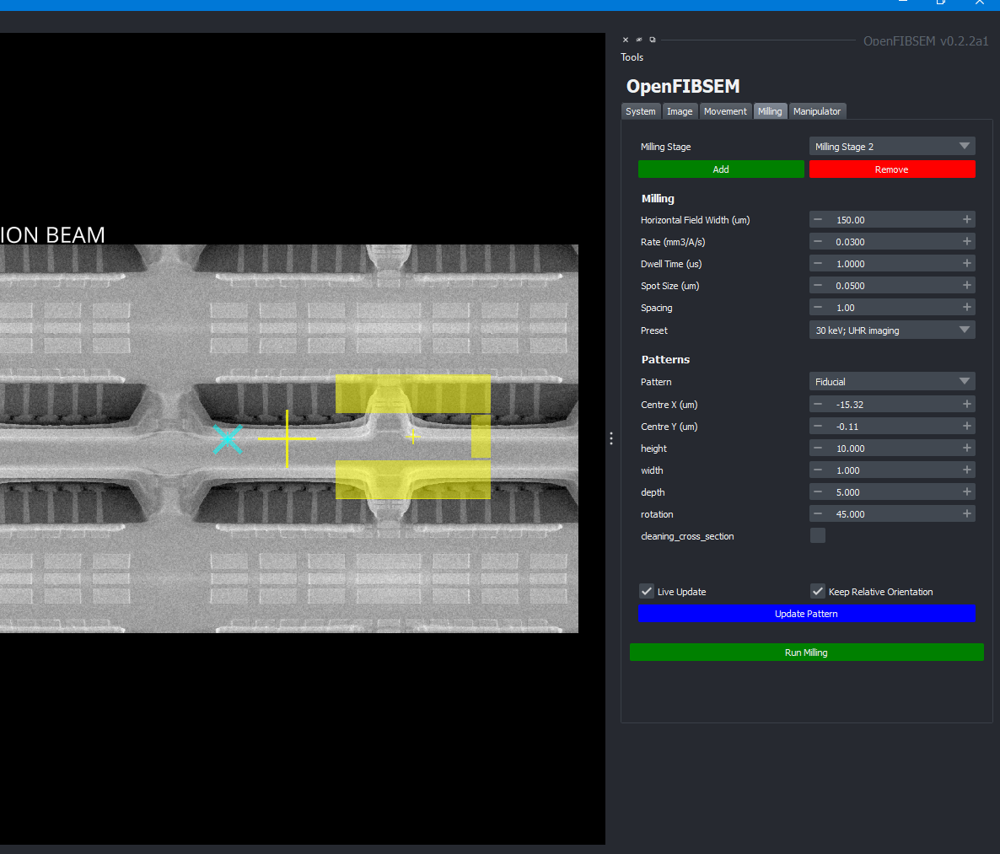
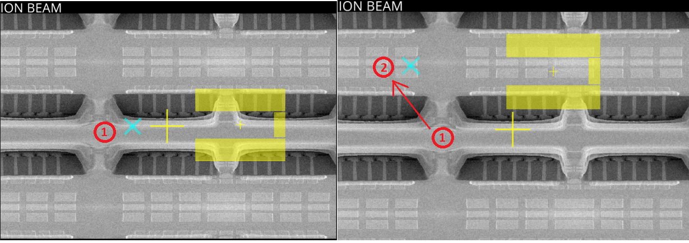
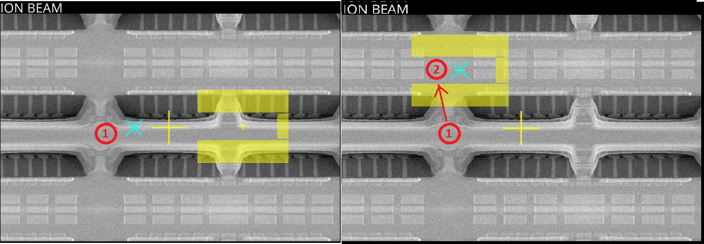
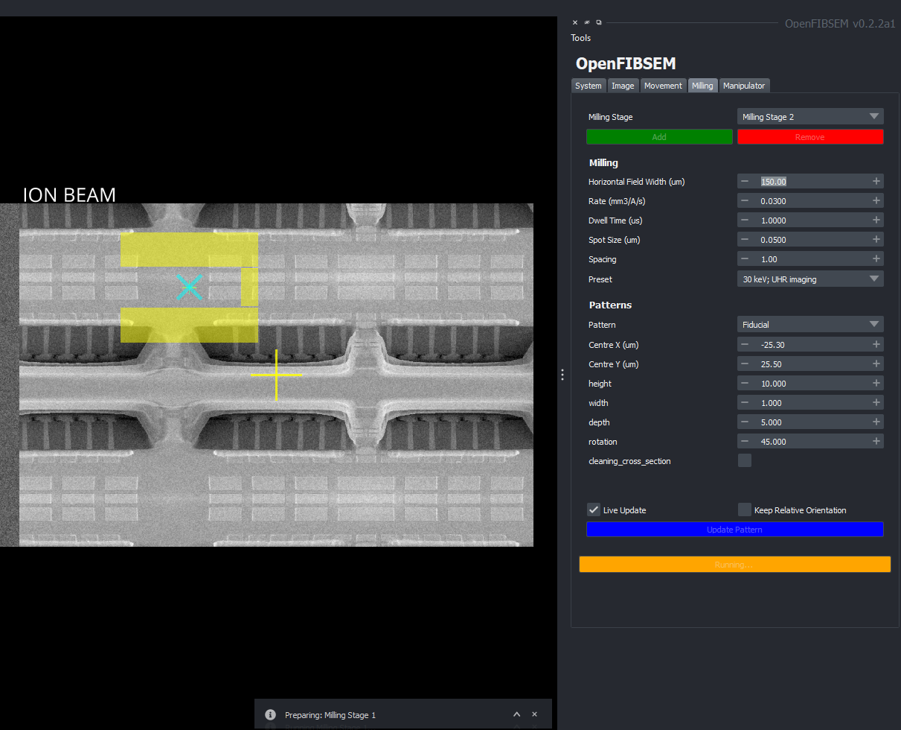

# Milling

The milling section allows the user to setup and control the milling process using the FIB. This includes setting up the milling patterns and specific milling settings.

The milling process is done in milling stages. Each milling stage comprises of a pattern and the milling settings required for this pattern. The milling stages are then executed in the order of creation. A milling stage can be added by clicking the 'Add' button. An ion beam image must be taken first before a milling stage can be added. The stages are named in order of creation. A stage can be removed by pressing the remove button. A specific milling stage can be selected by choosing it from the milling stage drop down.

## Milling Settings

For each milling stage, there are milling settings associated with it, along with the pattern to be milled. The milling settings are specific to each manufacturer:

TESCAN:

* Milling rate (specified in mm3 / A / s)
* Dwell time (microseconds)
* Spot size (microns)
* Spacing (spot spacing)  
* Preset  

ThermoFisher:

* Current (A)
* Application File

## Milling Patterns

The pattern specifies the kind of pattern to be milled. These include simple shapes such as rectangles, circles and lines. However, OpenFIBSEM also includes a host of complex shapes ideal for lamella preparation. Each pattern has its own unqiue set of parameters that can be set. The full list of patterns is includes:

* Rectangle
* Line
* Circle
* Trench
* Horseshoe
* Undercut
* Fiducial
* Spot Weld
* Micro Expansion
* Waffle Notch
* Clover
* Triforce
* Annulus
* Bitmap (ThermoFisher Only)

 By default, when changes are made to the pattern settings in the UI, the pattern displayed in the viewer is updated live. However, this can be disabled if necessary by unchecking the 'Live Update' checkbox.

A pattern's position can be chosen relative to it's location on the ion image. This can be manually moved by entering coordinates in the centre x and centre y field. The coordinates of (0,0) is the centre of the image.

Alternatively, the pattern can be moved anywhere within the image by pressing the *Shift* key and left-clicking on the image. If the pattern is out of bounds, it will return an out-of-bounds error and the pattern will remain where it was.

## Multiple Stages

Multiple stages can be setup at once. In this manner, once multiple stages are ready, clicking "Run Milling" will run all the stages sequentially without any more manual input. This avoids the repetitive nature of setting up and running stages individually.

When there are multiple stages active, each seperate stage is coloured differently for identification. Changes can only be made to one stage at a time. To make changes to the stage, select the stage from the drop down menu and then make the relevant changes to the pattern or milling settings.

### Moving Multiple Patterns

*Shift* + *Ctrl* + Left-Click

Moving multiple patterns simultaneously is also possible. To do this, press the *Shift* + *Ctrl* + Left-Click on a position in the ion image. By default, the checkbox "Keep Relative Orientation" is selected. This means when moving all the patterns, the relative orientation of the patterns to each other is kept the same. If this is not selected, all the patterns will be centred on the same new point.

Moving multiple patterns uses the current selected pattern as the reference to move. I.e. the currently selected stage will move to the point chosen, while the other stages will move relative to this stage, retaining their relative position.

To move all the patterns to a single location regardless of relative orientation, uncheck the "Keep Relative Orientation" checkbox. This will move all the patterns to the same location.

## Run Milling

Once satisfied with the milling and pattern settings and the stages are set as desired. Click "Run Milling" to perform milling. The milling stages will be performed in their numerical sequence order. When milling is running, the button will be highlighted orange

**DURING MILLING, MOST OTHER FUNCTIONALITY IS DISABLED INCLUDING IMAGE ACQUISITION AND STAGE MOVEMENT**

Once milling is complete, the button will return to its original colour and other functionality will be restored. The milling stages can be repeated or new ones can be added. The system will also automatically restore back to the original imaging current, and re-image the sample.
