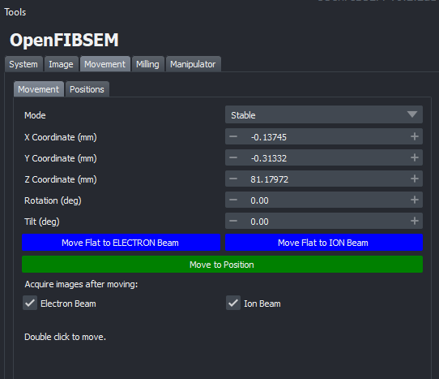
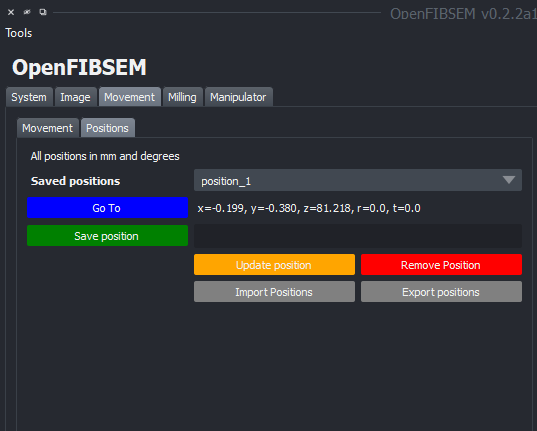

# Movement

The movement tab provides functionality and control of the stage movement in the microscope system. This includes the ability to move the stage in the x, y and z directions as well as tilt and rotation if these are available in the microscope. 

Additionally, the movement of the stage can be done by double clicking on a point in the image itself either in the electron or ion image (An image must be taken first). This will move the stage to the point clicked on and the point will now be centred in the view.

## Stage Movement

In the movement tab, the current coordinates are displayed. The coordinates are displayed in mm and angles in degrees where applicable. To move to a specific coordinate, enter the coordinates in the respective fileds and click 'Move to Position'. This will move the stage to the specified position. 

The stage can also be tilted directly to be flat to each respective beam if necessary. To do this, click on either 'Move Flat to ELECTRON Beam' or 'Move Flat to ION Beam'. This will move the stage to be flat to the respective beam.

By default, after every movement, an image is taken at the new position and the viewer is updated. However, this behaviour can be disabled if necessary. To disable this for the electron beam or ion beam or both, select the respective checkbox under 'Acquire images after moving'. The images will be taken with settings as specified in the image tab. For example, if autocontrast is enabled, the image will be autocontrasted every time a movement is made. This may be unnecessary and can be disabled if desired in the imaging tab.

## Positions

Specific positions can also be saved to be accessed or modified later. The positions tab allows control over this functionality

To save a named position, simply enter a name for the position in the save position field and click 'Save position'. This will save the position and add it to the list of saved positions in the drop down. It's coordinates are displayed as well. To switch between saved positions, open the drop down and click on the saved position to go to and click 'Go To'. 

A saved positions location can be updated if necessary. At the desired location, select the saved position from the drop down and click 'Update position'. This will update the position to the current location.

A saved position can be removed if necessary by clicking 'Remove position'. This will remove the position from the list of saved positions.

Saved positions can also be exported and imported if necessary. To export, click 'Export positions' and select a location to save the positions to. This will save the positions to a .yaml file. To import, click 'Import positions' and select the .yaml file to import. This will import the positions from the file and add them to the list of saved positions.

