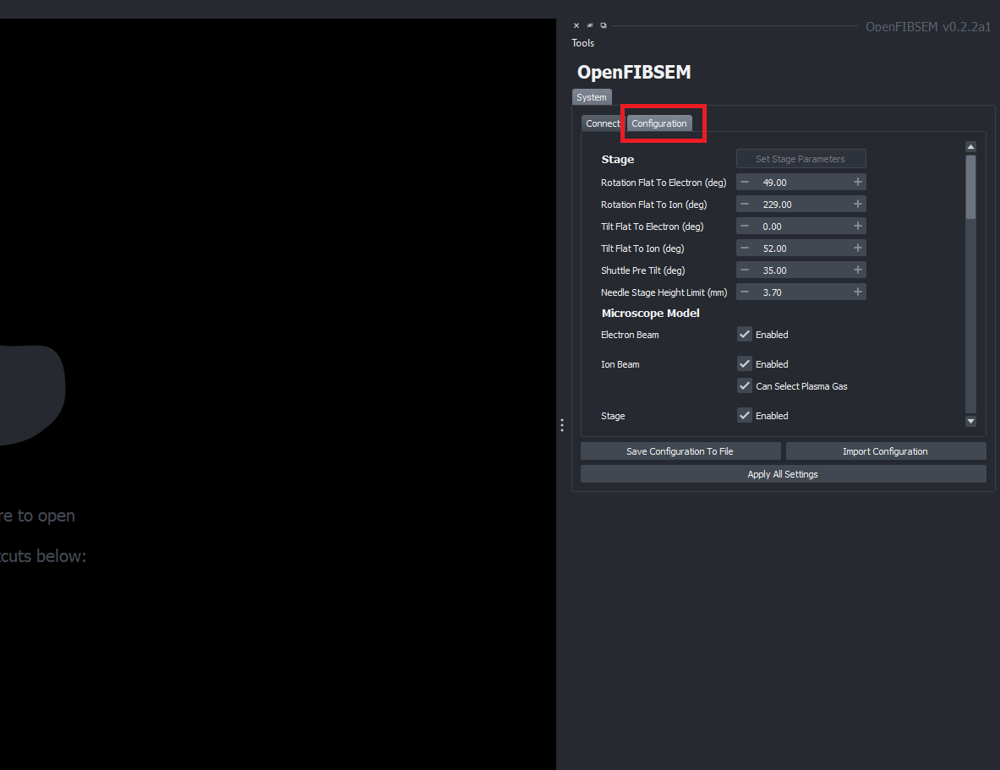
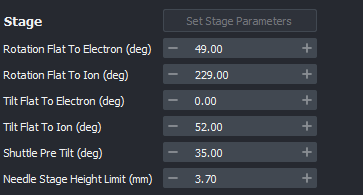
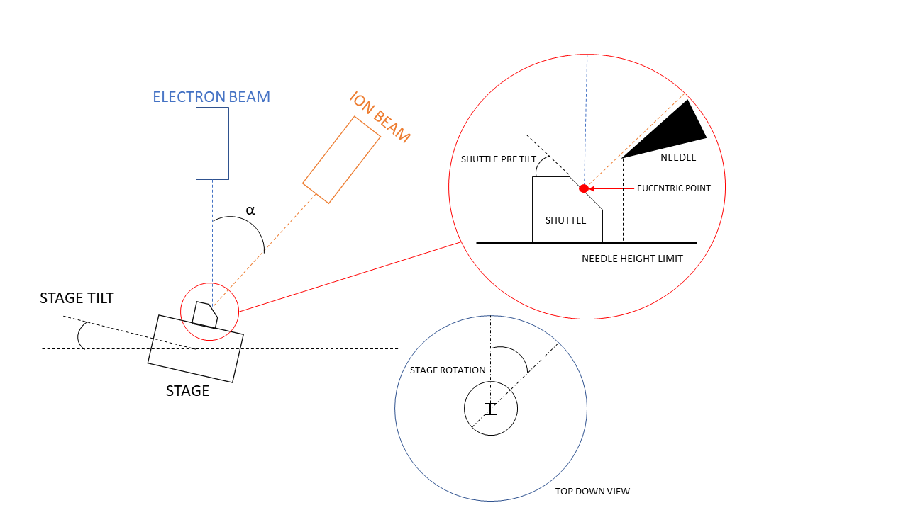
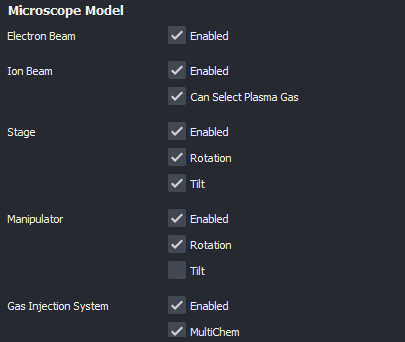
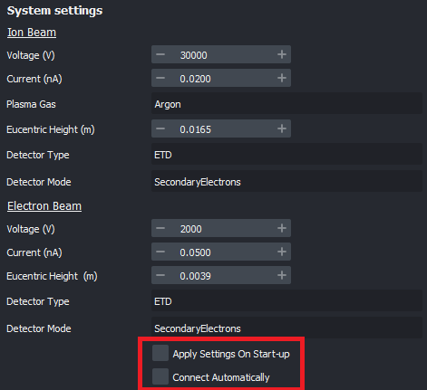
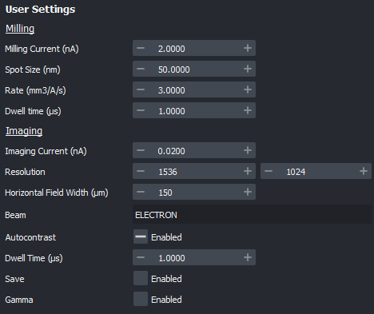

# System Configuration and Setup Guide

This guide outlines the steps to configure and setup the system parameters. Each subsystem will be explained. This process does not need to be done everytime the system is started. A default is provided. If changes are made, this can be saved to a file and loaded on startup.

On start up of the application the configuration tab will be loaded. Here you can make changes as necessary. 

To load the default configuration and connect to the microscope, simply click the "Connect to Microscope" button in the connect tab. This will load the default configuration and connect to the microscope.

The configuration can be saved and loaded from a file. This allows for the user to save a configuration and load it on start up. To save, click "Save configuration to file" and select a location to save the file. To load, click "Import Configuration" and select the file to load. The file to load must be a configuration type yaml file that has been previously saved.

The configuration parameters can be altered before connection to the microscope. To make changes to the microscope configuration while it is connected, click "Apply All Settings" to apply the changes. This will update the parameters in the program.

## Parameters

### Stage Settings

The stage parameters can be defined in this section. This section outlines the basic stage and beam column angles which allows for correct calculations of the stage position and subsequently, the movement of the stage.

Referring to the diagram above, the stage parameters are defined as follows:

* Rotation flat to electron/ion beam

This is the rotation of the stage in degrees in which the sample will be flat to the respective beam when using a pre-tilted shuttle.

* Tilt flat to electron/ion beam

This is the core tilt of the stage in degrees in which the sample will be flat to the respective beam (for a shuttle with NO pre-tilt). On the diagram, the angle labelled alpha is the tilt flat to the ion beam. Typically a system will be perpendicular to the electron beam, so the tilt flat to the electron beam will be 0.

On ThermoFisher systems this is usually 52 degrees, and on TESCAN systems this is usually 55 degrees.

* Shuttle Pre-Tilt

This is the pre tilted angle of the shuttle if a pre tilted shuttle is used.

* Needle Stage Height Limit

This is the limit of the needle stage height in mm. This is used to prevent the needle stage from crashing into the sample or stage (ThermoFisher systems only).

### Microscope Model Settings

The microscope parameters can be defined in this section. This section specifies the main hardware inclusions available on the microscope. This lets the user enable or disable functionality depending on availablity. For example, if a system does not have a manipulator, this can be disabled here and other functionality can be used without errors

### System Settings

The system parameters related to the ion and electron beams can be defined and set up in this section. In this section, you can also specify if the system is to be connected directly on start up or manually connect to the microscope each time.

### User Settings

The default imaging and milling parameters are be specified in this section.  

 

