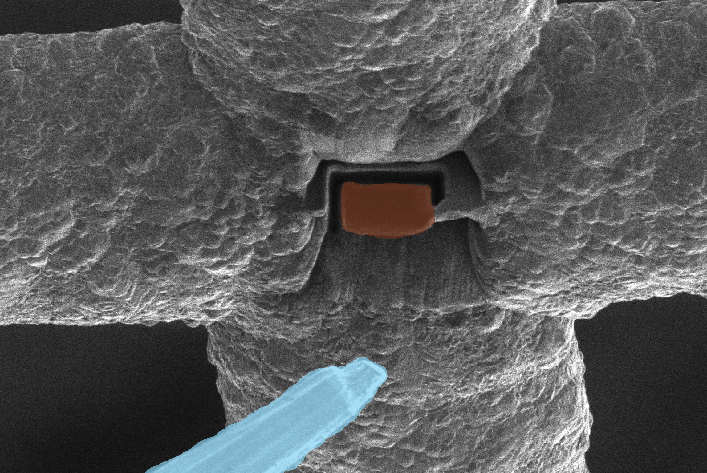
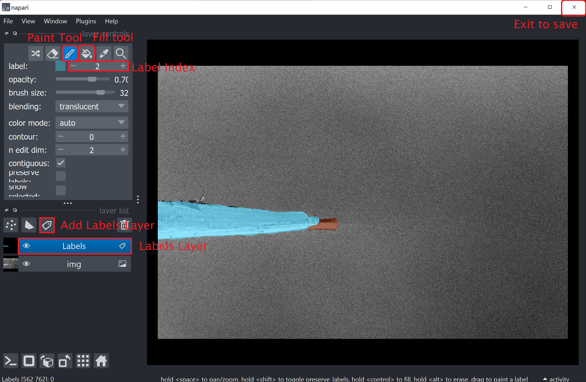

# FIBSEM Segmentation
This module contains all the code to label a segmentation dataset, train a model, and deploy the model for inference.



## Getting started
1. All of the required installation steps should have already been completed in the base README.
2. Install the additional dependencies
```bash
$ conda activate fibsem
$ conda install pytorch torchvision cudatoolkit segmentation-models-pytorch -c pytorch -c conda-forge

```
3. (Optional) Download the sample dataset ([Google Drive](https://drive.google.com/file/d/1Q0UscceYAY4cdbBndNMJpaogTkFZ73hY/view?usp=sharing)).
4. (Optional) Download the sample model ([Google Drive](https://drive.google.com/file/d/1rON6AalnloPkpan-ASrjbI83sQmCceSF/view?usp=sharing))


## Running the segmentation code
NOTE: The code relating to the creation and training of a segmentation model expects the dataset images and labels to be in a TIFF File format. If you are utilising the labelling code within this repository to label your dataset, this is automatically done for you. If you are using a pre-existing dataset that is not in TIFF File format, there is a helper function in dataset.py that can be used to convert images of any extension to TIFF. 

NOTE: It is assumed during labelling and training that all of your input images are of the same size. This is a prerequisite.

Labelling is performed by the labelling ui, training and validation is performed by train.py, and inference is performed by inference.py. Training, and inference expect a yaml config file that is used to specify the directories and parameters to be used.

### Config.yml
```
labelling:
  raw_dir: directory containing the raw data to be labelled
  data_dir: directory to save the labelled data to
train:
  data_dir: directory containing the labelled dataset
  save_dir: directory to save the model weights to
  checkpoint: path to model if you would like to resume training
  encoder: specify model architecture. List of available encoders in readme.
  cuda: enable/disable CUDA training
  epochs: number of epochs to train for
  batch_size: number of batches per epoch
  num_classes: number of classes in segmentation labels. Includes background as class 0.
  learning_rate: learning rate used during training
  wandb: logs information and plots to wandb if true
  wandb_project: name of the wandb project
  wandb_entity: user name for wandb
inference:
  data_dir: directory containing images for inference
  model_dir: directory containing saved model weights
  output_dir: directory to save the outputs to
  cuda: determines whether to use GPU
  encoder: specify model architecture. List of available encoders in readme.
  num_classes: number of classes in the segmentation labels. Includes background as class 0.
  wandb: boolean value to determine whether or not to save to wandb.
  wandb_project: name of the wandb project
  wandb_entity: user name for wandb
```

### Labelling
The code for labelling the dataset can be found in labelling.py. It expects the directory of unlabelled images and the directory to save the labelled images to be found in the config.yml file. 

To run this file from the command line:
 
```
$ conda activate fibsem
$ fibsem_labelling
```
Once labelling is running and the unlabelled images have been imported, a napari viewer will open with the image already loaded. To create a segmentation label:
1. Select the paint brush icon, and begin painting the objects of interest. To save time it is recommended to paint the outline of each object, and then use the fill tool. 
3. If you have multiple classes, do not create a new Labels layer for each class, simply use a different index for each class in the Labels layer. NOTE: MAKE SURE YOU ARE CONSISTENT WITH THE INDEX FOR EACH CLASS.
4. When you have finished labelling an image,  press next to go to the next image. You can return to any image at any time to edit. 
5. When you are finished, close the viewer

TODO: @patrickcleeve2 update


### Format requirements
Images and labels must be .tiff, with 2 dimensions (grayscale, i.e. (H,W) and not (H,W,C)). Length and width must be the same for all images and labels, and be divisible by 32. 
Labels need to be in class index format (1,2,3..., with 0 being background) and not normalised between 0 and 255. 

A function called validate_dataset() is run when the SegDataset class is instantiated. This function checks to ensure that the training dataset are .tif/.tiff images, that they are the same size, and that they are 2D grayscale images. If any of these requirements are not met, an error is raised explaining which requirements have not been met, and which utility functions can be utilised to fix them.

update will relax these requirements.

### Training
The code for training and validation can be found in train.py. It expects the labelled dataset directory as well as the directory to save your trained model in the config.yml file. The rest of the options have defaults that can be changed as needed. 

If you have a pre-existing dataset that is already labelled and thus have not used labelling.py, train.py expects the data formatted as follows:

data_dir/
  -- images/
  -- labels/

With images and labels in the TIF/TIFF format.

To run this file from the command line:
1. cd into the segmentation directory

2. 
```
$ python train.py --config config.yml
```

The following is a list of encoders that are available for use with segmentation-model-pytorch. By default resnet18 is chosen.
* "resnet18",
* "resnet34",
* "resnet50",
* "resnet101", 
* "resnet152",
* "resnext50_32x4d",
* "resnext101_32x16d",
* "resnext101_32x32d",
* "resnext101_32x48d",
* "dpn68",
* "dpn98",
* "dpn131",
* "vgg11",
* "vgg11_bn",
* "vgg13",
* "vgg13_bn",
* "vgg16",
* "vgg16_bn",
* "vgg19",
* "vgg19_bn",
* "senet154",
* "se_resnet50",
* "se_resnet101",
* "se_resnet152",
* "se_resnext50_32x4d",
* "se_resnext101_32x4d",
* "densenet121",
* "densenet169",
* "densenet201",
* "densenet161",
* "efficientnet-b0",
* "efficientnet-b1",
* "efficientnet-b2",
* "efficientnet-b3",
* "efficientnet-b4",
* "efficientnet-b5",
* "efficientnet-b6",
* "efficientnet-b7",
* "mobilenet_v2",
* "efficientnet-b0",
* "xception"

### Inference
The code for performing inference is found in inference.py. When customising the config file, the parameters should be the same as what was used to train the model originally in train.py, particularly the encoder, and the number of classes. The results of the inference can be found on WandB.

To run this file:
1. cd into the segmentation folder.
2. 
```
$ python inference.py --config config.yml
```

## Visualisation
Training and inference can be visualised with the use of WandB. This is done by setting the wandb parameter to true in the config settings. You will need a wandb account to view the logs. 

### Segmentation Examples
Data - raw data images can be found in docs/imgs/raw

Labels - Segmentation Labels can be found in docs/imgs/labels

Combined - Labels superimposed on the raw data can be found in docs/imgs/combined


### Utils available
Several utils functions are available to convert the data to the correct format. Running the dataset.py file will give out information on which function needs to be run to transform the dataset into the expected format for trainning and inference. 
Funtions available:
convert_to_grayscale()
pad_data()
convert_img_size()
convert_to_tiff()